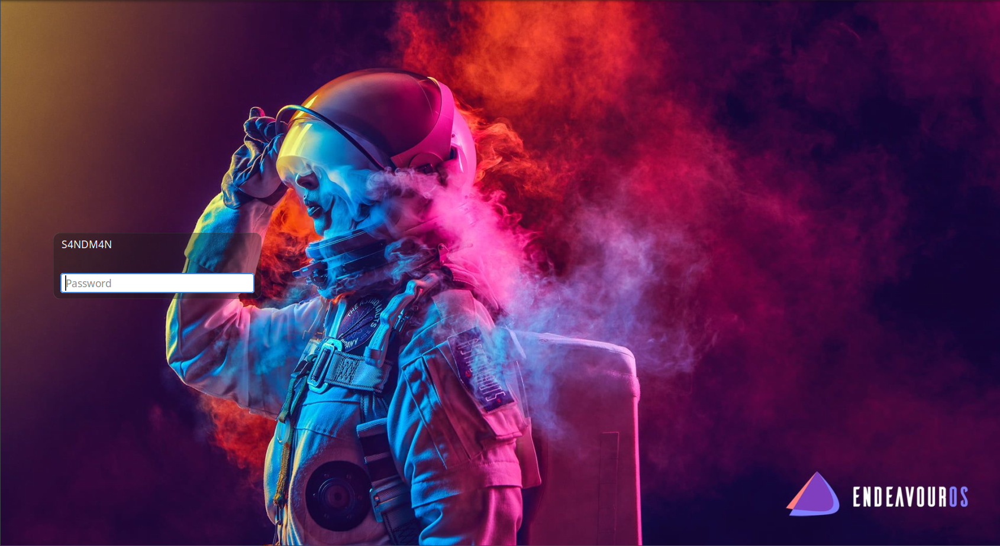
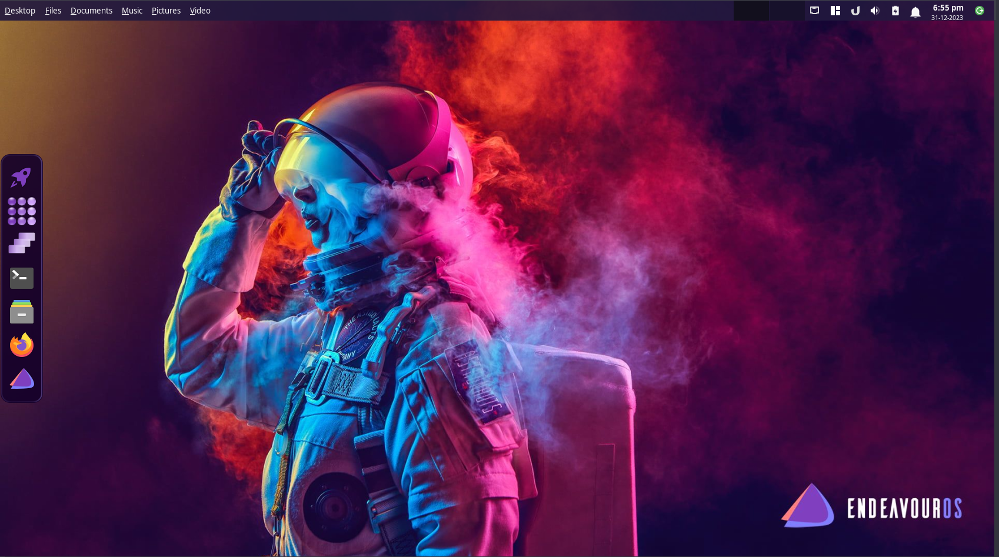
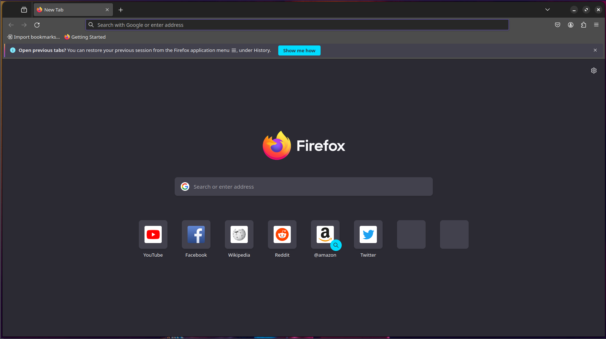
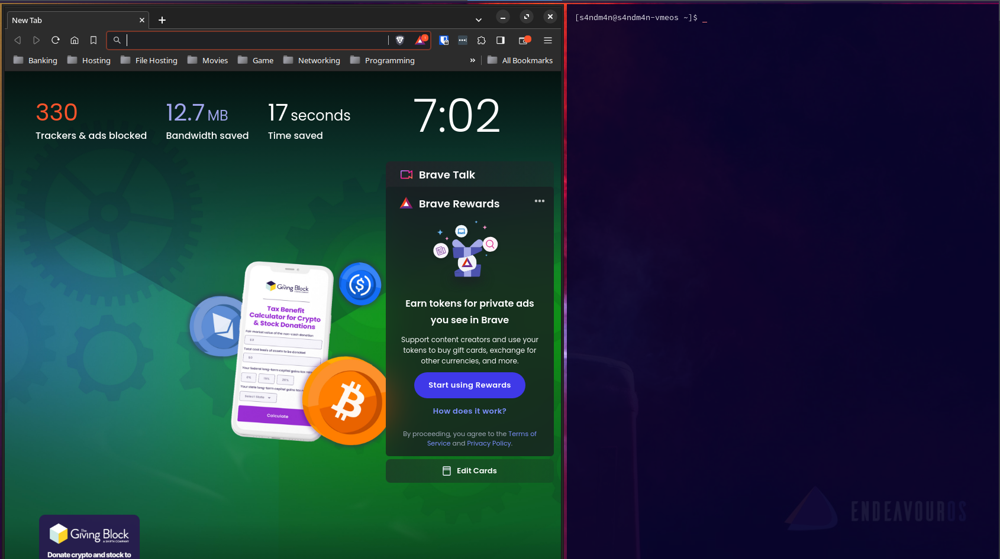

<p align="center">

</p>

<h1 align="center">Rocket Ui</h1>

## Introducing Rocket Ui
First thing we would like to express is Rocket Ui is **not** a theme and **not** a distribution. It is a an alternative user interface for the [Xfce](https://wiki.xfce.org/) desktop environment. The core of the Rocket Ui is based on [EndeavourOS](https://endeavouros.com/). We made sure the interface stay's out of the way when you're working and let you use the entire real estate of the screen.

## Features
- Let the user use the entire screen area.
- Windows can be used as tilled or as normal windows.
- Global menu which appears in the top panel. Similar to MacOS interface.
- Customized dock contains all the shortcuts needed.
- [Ulauncher](https://github.com/Ulauncher/Ulauncher) launcher is the main menu system.
- Used a customized version of [rofi](https://github.com/davatorium/rofi) for the [global menu](https://github.com/adi1090x/rofi-emoji) and [application launcher](https://github.com/adi1090x/rofi-emoji).
- More...

## Installation
- Still work in progress. AUR package will soon be available ....

## Folder Structure
```
RocketUi/
├─ .config/
│  ├─ autostart/
│  │  ├─ cortile.desktop
│  │  ├─ plank.desktop
│  │  ├─ plankdocktheme.desktop
│  │  ├─ ulauncher.desktop
│  ├─ cortile/
│  │  ├─ config.toml
│  ├─ plank/
│  │  ├─ dock1/
│  │  │  ├─ launchers/
│  │  │  │  ├─ 00-rocketLauncher.dockitem
│  │  │  │  ├─ 01-rocketAppgrid.dockitem
│  │  │  │  ├─ 02-rocketSwitcher.dockitem
│  │  │  │  ├─ 03-xfce4-terminal.dockitem
│  │  │  │  ├─ 04-fileManager.dockitem
│  │  │  │  ├─ 05-firefox.dockitem
│  │  │  │  ├─ 06-eosWelcome.dockitem
│  ├─ rofi/
│  │  ├─ colors/
│  │  │  ├─ adapta.rasi
│  │  │  ├─ arc.rasi
│  │  │  ├─ black.rasi
│  │  │  ├─ catppuccin.rasi
│  │  │  ├─ cyberpunk.rasi
│  │  │  ├─ dracula.rasi
│  │  │  ├─ everforest.rasi
│  │  │  ├─ gruvbox.rasi
│  │  │  ├─ lovelace.rasi
│  │  │  ├─ navy.rasi
│  │  │  ├─ nord.rasi
│  │  │  ├─ onedark.rasi
│  │  │  ├─ paper.rasi
│  │  │  ├─ solarized.rasi
│  │  │  ├─ tokyonight.rasi
│  │  │  ├─ yousai.rasi
│  │  ├─ launchers/
│  │  │  ├─ type-3/
│  │  │  │  ├─ shared/
│  │  │  │  │  ├─ colors.rasi
│  │  │  │  │  ├─ fonts.rasi
│  │  │  │  ├─ launcher.sh
│  │  │  │  ├─ style-3.rasi
│  │  ├─ scripts/
│  │  │  ├─ launcher_t3
│  │  ├─ config.rasi
│  ├─ unlauncher/
│  │  ├─ user-themes/
│  │  │  ├─ RocketLauncher/
│  │  │  │  ├─ generated.css
│  │  │  │  ├─ manifest.json
│  │  │  │  ├─ theme-gtk-3.20.css
│  │  │  │  ├─ theme.css
│  │  ├─ settings.json
│  │  ├─ shortcuts.json
│  ├─ xfce4/
│  │  ├─ desktop/
│  │  │  ├─ icons.screen.latest.rc
│  │  │  ├─ icons.screen0-1264x784.rc
│  │  │  ├─ icons.screen0-1674x929.rc
│  │  │  ├─ icons.screen0-1904x1028.rc
│  │  │  ├─ icons.screen0-1904x1030.rc
│  │  │  ├─ icons.screen0-1904x1064.rc
│  │  ├─ panel/
│  │  │  ├─ datetime-12.rc
│  │  │  ├─ datetime-12.rc.817.tmp
│  │  │  ├─ datetime-12.rc.917.tmp
│  │  ├─ terminal/
│  │  │  ├─ terminalrc
│  │  ├─ xfconf/
│  │  │  ├─ xfce-perchannel-xml/
│  │  │  │  ├─ displays.xml
│  │  │  │  ├─ keyboards.xml
│  │  │  │  ├─ parole.xml
│  │  │  │  ├─ ristretto.xml
│  │  │  │  ├─ thunar.xml
│  │  │  │  ├─ xfce4-appfinder.xml
│  │  │  │  ├─ xfce4-desktop.xml
│  │  │  │  ├─ xfce4-keyboard-shortcuts.xml
│  │  │  │  ├─ xfce4-notifyd.xml
│  │  │  │  ├─ xfce4-panel.xml
│  │  │  │  ├─ xfce4-power-manager.xml
│  │  │  │  ├─ xfce4-screensaver.xml
│  │  │  │  ├─ xfce4-session.xml
│  │  │  │  ├─ xfce4-settings-editor.xml
│  │  │  │  ├─ xfce4-settings-manager.xml
│  │  │  │  ├─ xfce4-taskmanager.xml
│  │  │  │  ├─ xfce4-terminal.xml
│  │  │  │  ├─ xfdashboard.xml
│  │  │  │  ├─ xfwm4.xml
│  │  │  │  ├─ xsettings.xml
├─ etc/
│  ├─ xdg/
│  │  ├─ xdg-rocket/
│  │  │  ├─ .bashrc
│  │  │  ├─ .xinitrc
│  │  │  ├─ xinitrc
├─ plankthemesettings/
│  ├─ docks.ini
├─ usr/
│  ├─ bin/
│  │  ├─ launchrocket
│  │  ├─ rocket-session
│  ├─ share/
│  │  ├─ applications/
│  │  │  ├─ eosWelcome.desktop
│  │  │  ├─ rocketappgrid.desktop
│  │  │  ├─ rocketlauncher.desktop
│  │  │  ├─ rocketswitcher.desktop
│  │  ├─ icons/
│  │  │  ├─ duckduckgo.png
│  │  │  ├─ github-logo.png
│  │  │  ├─ RocketUIgrid.png
│  │  │  ├─ RocketUiLauncher.png
│  │  │  ├─ RocketUiScreens.png
│  │  ├─ lightdm/
│  │  │  ├─ lightdm.conf.d/
│  │  │  │  ├─ 60-rocket.conf
│  │  ├─ plank/
│  │  │  ├─ themes/
│  │  │  │  ├─ rocketplank/
│  │  │  │  │  ├─ dock.theme
│  │  ├─ themes/
│  │  │  ├─ rocket-switch/
│  │  │  │  ├─ xfdashboard-1.0/
│  │  │  │  │  ├─ animations.xml
│  │  │  │  │  ├─ effects.xml
│  │  │  │  │  ├─ rocket-dashboard.css
│  │  │  │  │  ├─ rocket-dashboard.png
│  │  │  │  │  ├─ xfdashboard-secondary.xml
│  │  │  │  │  ├─ xfdashboard.css
│  │  │  │  │  ├─ xfdashboard.theme
│  │  │  │  │  ├─ xfdashboard.xml
│  │  ├─ xsessions/
│  │  │  ├─ rocket.desktop

```

## Screenshots
- Login screen


- Desktop


- While Browsing


- Tilling


<p align="right"><i><sub>Made using ❤️ and tone of tea ....</sub></i></p>
<hr>
<p align="center">
<sub><a href="https://endeavouros.com/">EndeavourOS</a> are registered trademarks of the community maintainers. Rocket Ui is not affiliated with EndeavourOS project.<br></sub>
<sub>Linux is a registered trademark of Linus Torvalds.</sub>
</p>